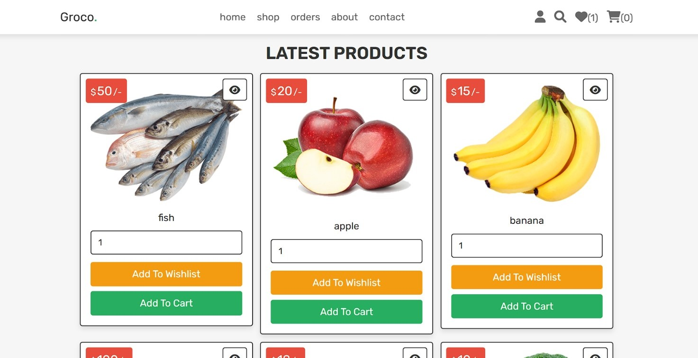

# 🛒 Grocery Store Webpage

Welcome to the Grocery Store Webpage project! This is a modern, responsive web application designed to showcase a digital storefront for a grocery business. It features product listings, categories, a shopping cart system, and a clean UI that can be customized to suit any grocery business.

## 🚀 Features

- Browse grocery items by category
- Search and filter products
- Add to cart functionality
- Responsive design
- Built using HTML, PHP, CSS & JavaScript 
- Easy to customize and expand
- User authentication: Log in to the application with ease.
- Simple and minimalistic interface: Offers a seamless and intuitive user experience.
- Admin control panel for managing products and viewing orders

## 🖼️ Preview

